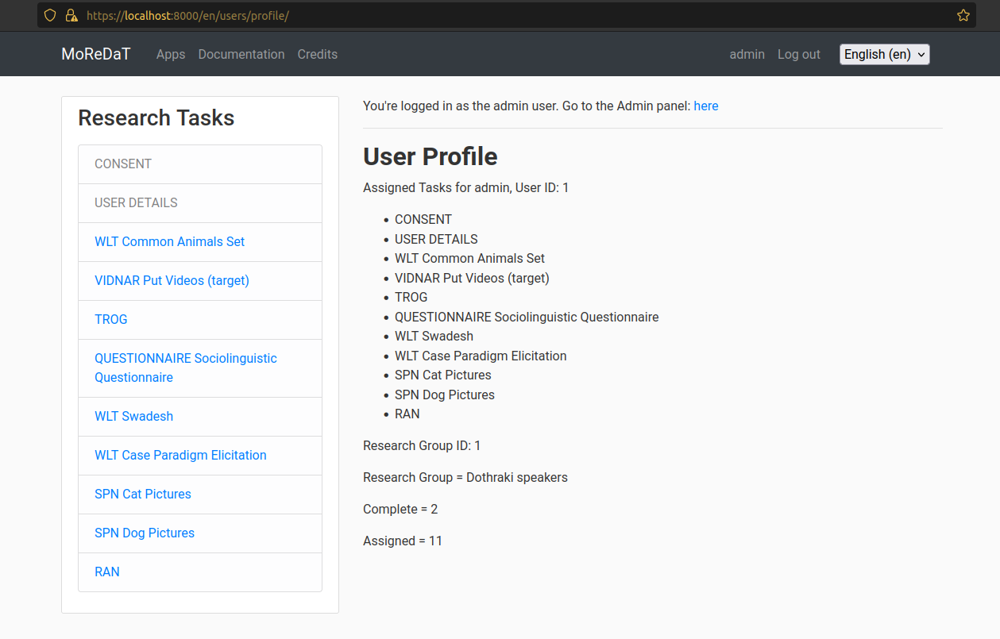
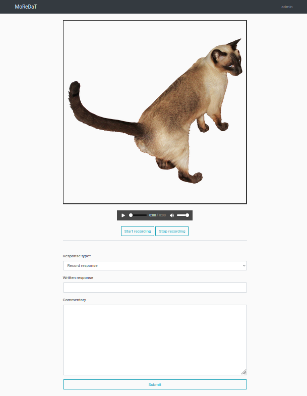

# MoReDaT -- Modular Remote Data Collection Tool 

## Short Description

MOREDAT is an example website for remote linguistic data collection. The site is written in Python using the Django framework; as such, it is easily customized for deployment on a webserver, and individual apps are modular, in so far as possible. As a researcher intending to engage in remote data-collection activities, you can start with a MOREDAT instance as a template for a from-scratch website, or you can integrate MOREDAT apps into another Django project. 

### Individual data collection apps are:

The app generate research data.

* Automatized picture naming task: Users name a series of pictures in rapid succession
* Free file upload form: Users can upload media files along with minimal meta information
* Questionnaires: Users can be assigned to complete any number of custom questionnaires
* Self-paced picture naming task: Users name series of pictures (and may also provide a written word + commentary) at their own pace
* "Test for reception of grammar"-like task: Users hear a an audio prompt (e.g. a phrase or sentence) and must select an image stimulus that best represents the audio (among three distractor stimuli)
* Video narration: Users narrate series of films
* Word list Translation: Users translate written stimuli (lists of words or phrases/sentences) in spoken form (and may also provide a written response + commentary)

### Scaffolding apps:

Scaffodling apps allow MOREDAT to function as a standalone program. They are responsible for functionality of the whole. They are:

* Main app: This is the root of the project. it contains the settings configuration and pointers to all the other apps, as well as the view functions for the landing pages and descriptions of other apps
* Users app: where users can be categorized by research group and tasks can be assigned to individuals or research groups

### Support apps are also included:

These apps neither generate data, nor are they responsible for functionality of the program -- nevertheless, they're usefull/necessary.

* Informed consent app: By default, all created users are assigned the task of giving their informed consent to participate in research. It is the administrator's job to provide the terms to which a participant must consent.
* User audio test: since many apps play audio and / or record the participant's voice, this app is worked into the welcome procedures for tasks that require recording the user. In this way, users who have hardware or software issues don't waste their time or create 'blank' response files.
* Documentation app: this is a wiki-like app with detailed information about how each app works and suggestions for making customizations.

## Funding Acknowledgement

This software was developed within the project _New Speakers of Minority Languages: Proficiency, Variation, and Change_ hosted at the Institute of Slavic Studies, Polish Academy of Sciences. The project received funding from the Norwegian Financial Mechanism 2014-2021, no. of grant 2020/37/K/HS2/02779.

## License

MOREDAT is licensed under Attribution-ShareAlike 4.0 International (CC BY-SA 4.0). This means you are free to 

* Share — copy and redistribute the material in any medium or format
* Adapt — remix, transform, and build upon the material
for any purpose, even commercially. 

Under the following conditions:

* Attribution — You must give appropriate credit, provide a link to the license, and indicate if changes were made. You may do so in any reasonable manner, but not in any way that suggests the licensor endorses you or your use.
* ShareAlike — If you remix, transform, or build upon the material, you must distribute your contributions under the same license as the original.
* No additional restrictions — You may not apply legal terms or technological measures that legally restrict others from doing anything the license permits.

## How to cite MoReDaT

MoReDaT was released into the world on 17 March 2022 at the The 6th Digital Humanities in the Nordic and Baltic Countries Conference (DHNB 2022), held at Uppsala University, in Sweden, on 15–18 March 2022. A full paper is in preparation, but for now please cite MoReDaT as a presentation from that meeting.

Suggested:

Borges, Robert. 2022. *MoReDaT: A Modular Remote Data-collection Toolkit for Linguistics Research*. Paper given at the DHNB2022 conference, Uppsala University.

This reference will be updated once there is a peer-reviewed publication available for citation.

I'd also be really glad to hear from anyone who will use MoReDaT in their research!

## How to run the demonstration version

1. Make sure you have Python installed. This tool was developed under v3.8.10, but other recent versions probably work fine.
2. Decide on a folder where you want the application to live and create a python virtual environment. Let's say for the sake of an example that you want the project to live in `~/Documents/MOREDAT/`. Create that folder and `cd` to it in terminal; run `python3 -m venv MOREDAT_env` to create the environment. Activate the environment with `source MOREDAT_env/bin/activate`.
3. Download or clone the example project to your `MOREDAT` folder.

	You should have 

		~/Documents/MOREDAT/
			MOREDAT_env/
			moredat/

 	`cd` into moredat and Install required packages while your environment is still active: 
 	
 	`pip install -r requirements.txt`
 	
4. Turn on the development server

    `python manage.py runsslserver` 

	The example site should be accessible in your browser at https://localhost:8000. NB. Make sure you visit the server over https:// – apps that require the user's microphone only work over https.

Further explanation, documentation, basic hints for customization and suggestions for deploy are available within the Demo site itself.

## Further development: the 'To do' list

### short term

* [] Complete task-checker for all apps. 

Some apps are lacking a task checker. When a user navigates to their profile the task checker iterates through all Tasks assigned to the User and looks for evidence of whether the task has actually been completed. If complete the task is marked as such in the database.

* [] Add script to create questionnaire from `.ods` spreadsheet.

Currently creation of questionnaires in the admin panel is somewhat tedious, as one must first create answer options, then add those options to answer sets, then create questions (related to answer sets depending on the question type), then add the question to a questionnaire object. It's possible to automate everything if the questionnaire data is in a spreadsheet.

### medium term

* [] Create script to populate a default database

The default database *structure* is established with the commands `python manage.py makemigrations` followed by `python manage.py migrate`, but this will create an *empty* database. I want to facilitate experimentation where potential MoReDaT admins feel safe to mess around and not worry about doing irreversible damage. The envisioned script should set all the defaults (users, research groups, etc) that you get when you first clone the repo.

* [] Revise parts of the RAN and TROG tasks to support multiple tasks based on this app.

Currently, unlike the other apps, RAN and TROG are 'one off' apps, meaning that an administrator cannot easily create multiple tasks based on these apps.

* [] complete internationalization examples of scaffolding site and task apps. 

Internationalization infrastructure is *sort-of* in place for different language versions. Some individual task instructions have been translated as part of MoReDaT's precursor project, but no translations have been included yet.

* [] Standardize some of the code patterns across MoReDaT

I learned a lot while working on this project. You can see in some of the older parts of the code that the style or conventions are a little different from more recent parts of the code. I'd rather it all be uniform from app to app...

### long term

* ..?

## More Screenshots

The user profile.

The admin panel.

The SPN task.
